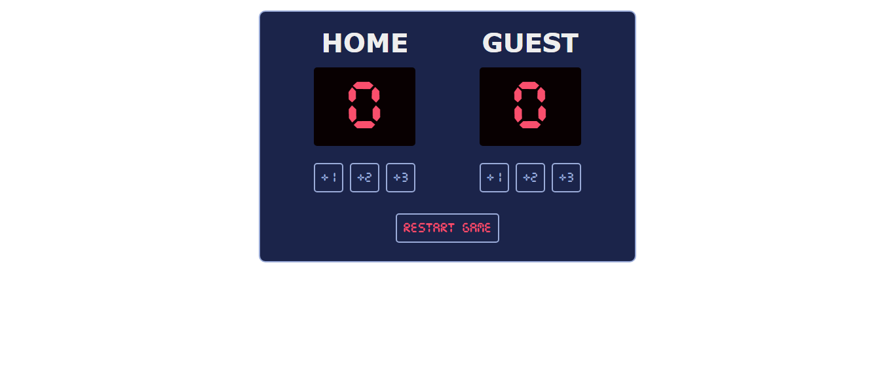

# Basketball Scoreboard

## Description

This project is a simple basketball scoreboard web app.
It allows users to track scores for two teams (Home and Guest) and update them using interactive buttons.

The app was built using HTML, CSS, and JavaScript, focusing on DOM manipulation, event handling, and UI feedback.

This task was completed as part of the [Scrimba The Fullstack Developer Path](https://scrimba.com/c0fullstack).

---

### Screenshot

---

### Links

- Solution URL: [GitHub](https://github.com/artemkotko14/basketball-scoreboard)
- Live Site URL: [Webpage](https://basketball-skoreboard-by-artem.netlify.app/)

---

## Features

- Add points (+1, +2, +3) for each team
- Separate score tracking for Home and Guest teams
- Restart button to reset scores
- Button click flash effect for better user feedback
- Custom digital-style font for scoreboard display
- Clean layout using Flexbox
- Reusable button styles with hover effects
- CSS variables for consistent color management

---

## Technologies Used

- HTML5
- CSS3
- Flexbox
- CSS Variables
- JavaScript
- Custom Fonts

---

## Future Improvements

- Add timer functionality
- Highlight leading team
- Add sound effects on score update
- Improve mobile responsiveness
- Add keyboard controls
- Refactor JavaScript to reduce repetition (DRY principle)

---

## Author

- Github - [Artem Kotko](https://github.com/artemkotko14)

---
